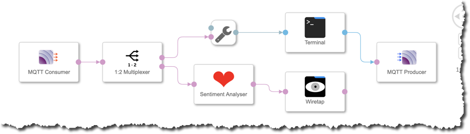
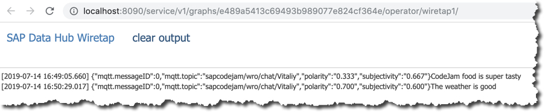
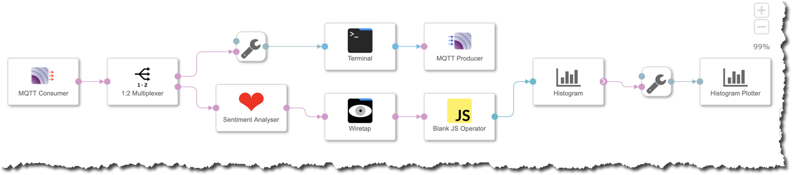

# Hands-on: Chat Scenario

<!-- TOC depthFrom:2 depthTo:4 withLinks:1 updateOnSave:1 orderedList:0 -->

- [Prerequisites](#prerequisites)
- [Install psutil in datahub container](#install-psutil-in-datahub-container)
- [Build custom operator ”Laptop as IoT device”](#build-custom-operator-laptop-as-iot-device)
	- [Create a new custom operator](#create-a-new-custom-operator)
	- [Configure the operator](#configure-the-operator)
- [Build a graph to send the IoT data](#build-a-graph-to-send-the-iot-data)
	- [Add an “IoT device” operator](#add-an-iot-device-operator)
	- [Add an MQTT Producer operator](#add-an-mqtt-producer-operator)
	- [Run the graph](#run-the-graph)
	- [Run MQTT Mosquitto client (optional)](#run-mqtt-mosquitto-client-optional)
- [Build a graph to receive the IoT data](#build-a-graph-to-receive-the-iot-data)
	- [Add an MQTT Consumer](#add-an-mqtt-consumer)
	- [Add “HTML Viewer” and “Python3” operators](#add-html-viewer-and-python3-operators)
	- [Build the code for real-time dashboard](#build-the-code-for-real-time-dashboard)
	- [Extend the graph to persist data in HDFS](#extend-the-graph-to-persist-data-in-hdfs)
	- [Run graphs and check HDFS](#run-graphs-and-check-hdfs)
- [Summary](#summary)

<!-- /TOC -->

## Prerequisites
You are using SAP Data Hub 2.4, developer edition, and have container `datahub` running. You can check it by executing
```sh
docker ps -f name=datahub
```

## Install textblob module in datahub container
`textblob` is a Python library for processing textual data. It provides a simple API for diving into common natural language processing (NLP) tasks, incl. sentiment analysis:: https://textblob.readthedocs.io/

First, let's check if it is already installed in your `datahub` container.
```sh
docker exec datahub pip3 show textblob
```

Do you need to install `psutil` in your `datahub` container? The container is running on openSUSE OS, so its software packages are managed by `zypper`.

In your host terminal execute:
```bash
docker exec datahub pip3 install textblob
```

## Create a new graph with Terminal only
In SAP Data Hub Modeller go to **Graphs** tab. Create a new graph.

Search for an operator “Laptop as IoT Device” and add it to your new graph.

Save the graph with parameters.

|Field|Value|
|-|-|
|Name|`codejam.chat.mqtttcp.sentiment`|
|Description|`MQTT-TCP-based Chat with sentiment analysis`|
|Category|`CodeJam` (type it if not yet existing)|

Click on **Show Configuration** of the graph. Change the **icon** to a `heart`. Save the graph.

You should see an icon of the graph changed in CodeJam category.

### Add a Terminal operator
Switch to Operators tab in the Modeller. Find and add **Terminal** operator to the graph.

Connect Terminal's `out1` port with its `in1` port.

### Run the graph
Save and run the graph.

After some time you should see it is “running” in the “Status” tab.

Click on the name of the graph there to show status details.

Right-click on Terminal operator and open its run-time UI.

In Terminal UI you can see the text you type is sent to the out port. And then immediately received on the in port and displayed.

## Add MQTT operators
### Add an MQTT Producer operator

Add an MQTT Producer operator to the graph. Open a configuration of MQTT Producer operator.

Modify additional parameters as following.

|Field|Value|
|-|-|
|mqttBroker|`tcp://test.mosquitto.org:1883`|
|topic|`sapcodejam/<location>/chat/<your_name>`, e.g. `sapcodejam/wro/chat/Vitaliy`|
|mqttClientID|`pcjdhc<location><your-user-ID>`|

>For MQTT protocol to work it is extremely important that **each client has a unique ID!**

Connect `out1` out port from ”Terminal” operator to `inmessage` in port of MQTT Producer.

### Add an MQTT Consumer
Add an “MQTT Consumer” operator.

Define parameters of the operator as following.

|Field|Value|
|-|-|
|mqttBroker|`tcp://test.mosquitto.org:1883`|
|topic|`sapcodejam/+/chat/#`|
|mqttClientID|`ccjdhc<location><your-user-ID>`|

>For MQTT protocol to work it is extremely important that **each client has a unique ID!**
>Please note, that for MQTT server this graph is a client different than the one sending IoT data from the previous graph.

Connect `outmessage` out port from MQTT Consumer operator to `in1` in port of ”Terminal”. The pop-up dialog "Select Conversion" will show up. Select the option "___Converts message to string, concatenating the header and body into one string.___"


### Run the graph
Now you have a graph that can receive data from the MQTT server to display it in its terminal, and to send the data typed in the the terminal to the MQTT server.


Save and run the graph.

Open the terminal's UI of the running graph and chat with others!

## Add sentiment analysis
Stop the graph.

Add **Sentiment Analyser** operator from "ML Examples (beta)" group and **1:2 Multiplexer** to the graph.

Remove existing connection between "MQTT Consumer" and "ToString Converter". Add three connections:
1. From MQTT Consumer's `outmessage` port to 1:2 Multiplexer's `in1` port,
2. From 1:2 Multiplexer's `out1` port to ToString Converter's `inmessage` port,
3. From 1:2 Multiplexer's `out1` port to Sentiment Analyser's `in` port.

To see the results of Sentiment Analyser let's add Wiretap operator to the graph and connect its `in` port to analyzer's `out` port.



### Run the graph
Save and run the graph.

Type some sentences (e.g. what you think about the CodeJam) in terminal.

Open UI of the Wiretap, and see results of sentiment analysis there. The ___polarity___ score is a number within the range [-1.0, 1.0]. The ___subjectivity___ is a number within the range [0.0, 1.0] where 0.0 is very objective and 1.0 is very subjective.



## Add sentiment plotter
Let's visualize sentiment scores aggregated into the 5 groups: "very negative", "negative", "neutral", "positive", "very positive".

### Add JS custom operator
You need to extract only polarity number from the Sentiment Analyser, and for that you will need a custom operator. This time you will use a JavaScript operator. So, add "Blank JS Operator" to the chart.

Add two ports to that JS operator:

Name|Type|Direction
|-|-|-|
|`in`|`message`|Input
|`out`|`float64`|Output

Open Script of the operator and paste the following code.

```JavaScript
$.setPortCallback("in",onInput);

function onInput(ctx,s) {

    $.out(s.Attributes["polarity"]);
}
```

This code is simple, but shows important elements of the API of the custom JS operator:
1. For every input on the port `in` the `onInput` callback function is called,
2. Only `polarity` attribute of the received `s` received on the input port is then sent to the `out` port.

Connect Wiretap's `out` port to `in` port of Blank JS Operator.

### Add Histogram operators
You will use use built-in Histogram Plotter. Two operators from Utilities group are required for that, so add them to the graph:
1. Histogram Plotter
2. Histogram

Connect `out` port of Blank JS Operator to `histIn` port of Histogram operator.

Open Configuration of the Histogram operator and set the following:

|Field|Value|
|-|-|
|`nBins`|5|
|`rangeMax`|1|
|`rangeMin`|-1|

Now connect `histOut` of the Histogram with `in1` of the Histogram Plotter.

In the "Select Conversion" pop-up select the option "___Converts message to string, concatenating the header and body into one string.___". Press **Ok**



### Run the graph
Save and run the graph.

Open UI of the Histogram Plotter operator. As you (and others are typing) in the terminal you should see as well the histogram of the sentiment updated.

## Summary
This is the end of the scenario, where you built a graph to learn about:
1. Terminal operator,
2. Wiretap operator,
3. Coding JavaScript custom operator and its API.
