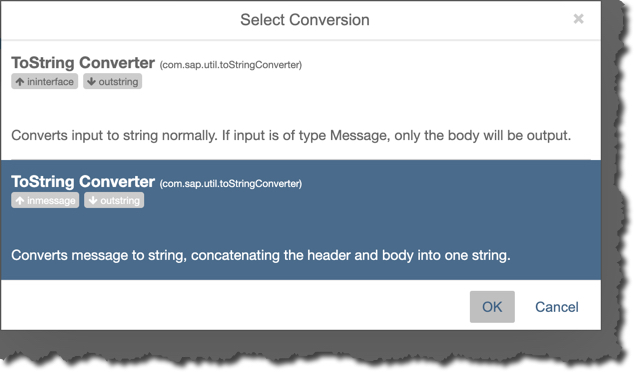

# Hands-on: Chat Scenario

<!-- TOC depthFrom:2 depthTo:4 withLinks:1 updateOnSave:1 orderedList:0 -->

- [Prerequisites](#prerequisites)
- [Install psutil in datahub container](#install-psutil-in-datahub-container)
- [Build custom operator ”Laptop as IoT device”](#build-custom-operator-laptop-as-iot-device)
	- [Create a new custom operator](#create-a-new-custom-operator)
	- [Configure the operator](#configure-the-operator)
- [Build a graph to send the IoT data](#build-a-graph-to-send-the-iot-data)
	- [Add an “IoT device” operator](#add-an-iot-device-operator)
	- [Add an MQTT Producer operator](#add-an-mqtt-producer-operator)
	- [Run the graph](#run-the-graph)
	- [Run MQTT Mosquitto client (optional)](#run-mqtt-mosquitto-client-optional)
- [Build a graph to receive the IoT data](#build-a-graph-to-receive-the-iot-data)
	- [Add an MQTT Consumer](#add-an-mqtt-consumer)
	- [Add “HTML Viewer” and “Python3” operators](#add-html-viewer-and-python3-operators)
	- [Build the code for real-time dashboard](#build-the-code-for-real-time-dashboard)
	- [Extend the graph to persist data in HDFS](#extend-the-graph-to-persist-data-in-hdfs)
	- [Run graphs and check HDFS](#run-graphs-and-check-hdfs)
- [Summary](#summary)

<!-- /TOC -->

## Prerequisites
You are using SAP Data Hub 2.4, developer edition, and have container `datahub` running. You can check it by executing
```sh
docker ps -f name=datahub
```

## Install textblob module in datahub container
`textblob` is a Python module that can be used for sentiment analysis: https://github.com/...

First, let's check if it is already installed in your `datahub` container.
```sh
docker exec datahub pip3 show textblob
```

Do you need to install `psutil` in your `datahub` container? The container is running on openSUSE OS, so its software packages are managed by `zypper`.

In your host terminal execute:
```bash
docker exec datahub pip3 install textblob
```

## Create a new graph with Terminal only
In SAP Data Hub Modeller go to **Graphs** tab. Create a new graph.

Search for an operator “Laptop as IoT Device” and add it to your new graph.

Save the graph with parameters.

|Field|Value|
|-|-|
|Name|`codejam.chat.mqtttcp.sentiment`|
|Description|`MQTT-TCP-based Chat with sentiment analysis`|
|Category|`CodeJam` (type it if not yet existing)|

Click on **Show Configuration** of the graph. Change the **icon** to a `heart`. Save the graph.

You should see an icon of the graph changed in CodeJam category.

### Add a Terminal operator
Switch to Operators tab in the Modeller. Find and add **Terminal** operator to the graph.

Connect Terminal's `out1` port with its `in1` port.

### Run the graph
Save and run the graph.

After some time you should see it is “running” in the “Status” tab.

Click on the name of the graph there to show status details.

Right-click on Terminal operator and open its run-time UI.

In Terminal UI you can see the text you type is sent to the out port. And then immediately received on the in port and displayed.

## Add MQTT operators
### Add an MQTT Producer operator

Add an MQTT Producer operator to the graph. Open a configuration of MQTT Producer operator.

Modify additional parameters as following.

|Field|Value|
|-|-|
|mqttBroker|`tcp://test.mosquitto.org:1883`|
|topic|`sapcodejam/<location>/chat/<your_name>`, e.g. `sapcodejam/wro/chat/Vitaliy`|
|mqttClientID|`pcjdhc<location><your-user-ID>`|

>For MQTT protocol to work it is extremely important that **each client has a unique ID!**

Connect `out1` out port from ”Terminal” operator to `inmessage` in port of MQTT Producer.

### Add an MQTT Consumer
Add an “MQTT Consumer” operator.

Define parameters of the operator as following.

|Field|Value|
|-|-|
|mqttBroker|`tcp://test.mosquitto.org:1883`|
|topic|`sapcodejam/+/chat/#`|
|mqttClientID|`ccjdhc<location><your-user-ID>`|

>For MQTT protocol to work it is extremely important that **each client has a unique ID!**
>Please note, that for MQTT server this graph is a client different than the one sending IoT data from the previous graph.

Connect `outmessage` out port from MQTT Consumer operator to `in1` in port of ”Terminal”. The pop-up dialog "Select Conversion" will show up. Select the option "__Converts message to string, concatenating the header and body into one string.__"


