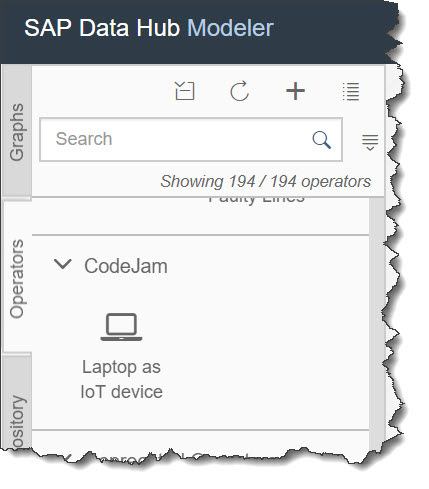
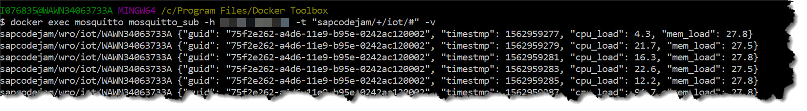

# Hands-on: IoT Scenario

<!-- TOC depthFrom:2 depthTo:4 withLinks:1 updateOnSave:1 orderedList:0 -->

- [Prerequisites](#prerequisites)
- [Install psutil in datahub container](#install-psutil-in-datahub-container)
- [Build custom operator ”Laptop as IoT device”](#build-custom-operator-laptop-as-iot-device)
	- [Create a new custom operator](#create-a-new-custom-operator)
	- [Configure the operator](#configure-the-operator)
- [Build a graph to send the IoT data](#build-a-graph-to-send-the-iot-data)
	- [Add an “IoT device” operator](#add-an-iot-device-operator)
	- [Add an MQTT Producer operator](#add-an-mqtt-producer-operator)
	- [Run the graph](#run-the-graph)
	- [Run MQTT Mosquitto client (optional)](#run-mqtt-mosquitto-client-optional)
- [Build a graph to receive the IoT data](#build-a-graph-to-receive-the-iot-data)
	- [Add an MQTT Consumer](#add-an-mqtt-consumer)
	- [Add “HTML Viewer” and “Python3” operators](#add-html-viewer-and-python3-operators)
	- [Build the code for real-time dashboard](#build-the-code-for-real-time-dashboard)
	- [Extend the graph to persist data in HDFS](#extend-the-graph-to-persist-data-in-hdfs)
	- [Run graphs and check HDFS](#run-graphs-and-check-hdfs)
- [Summary](#summary)

<!-- /TOC -->

## Prerequisites
You are using SAP Data Hub 2.4, developer edition, and have both containers `datahub` and `hdfs` running. You can check it by executing
```sh
docker ps -f "ancestor=datahub"
```
## Install psutil in datahub container
`psutil` is a cross-platform system monitoring in Python: https://github.com/giampaolo/psutil

You need to install `psutil` in your `datahub` container. The container is running on openSUSE OS, so its software packages are managed by `zypper`.

In your host terminal execute:
```bash
docker exec datahub zypper in --no-confirm gcc python3-pip python3-devel
docker exec datahub pip3 install psutil
docker exec datahub pip3 show psutil
```

## Build custom operator ”Laptop as IoT device”
### Create a new custom operator
Go to the Modeler window. Switch to **Operators** and click on **+ (Create operator)** icon.

Populate fields as following:

|Field|Value|
|-|-|
|Name|`codejam.iot.laptop`|
|Display name|`Laptop as IoT device`|
|Base Operator|`Python3Operator`|
|Category|`CodeJam` (type it, if not existing)|

Click **Ok**

### Configure the operator
Scroll to **Output Ports**. Add one new output port.

|Field|Value|
|-|-|
|name|`payload`|
|type|`string`|

Scroll to **Operator Configuration -> Parameters**. Add one new parameter.

|Field|Value|
|-|-|
|name|`intervalMs`|
|type|`String`|
|default value|`2000`|

Under “Operator Configuration” click on **Auto Propose**.

The “Type” will change to `codejam.iot.laptop`. Click edit icon **Open Type Schema** next to it.

On the **Edit type** form click on `intervalMs` property and complete configuration with:

|Field|Value|
|-|-|
|Title|`Interval (ms)`|
|Description|`Interval in microseconds`|
|Data type|`Number`|
|Required|`True`|

Click **OK** to close the type configuration.

Scroll to **Script** and in Inline Editor paste code [`codejam.iot.laptop.py`](code/codejam.iot.laptop.py)

```python
import psutil   # https://pypi.python.org/pypi/psutil
import time
import uuid
import json
# import sys, platform # if need to read system params, like OS type

def readCPU():
    return psutil.cpu_percent(percpu=False, interval=1)

def readMEM():
    return psutil.virtual_memory().percent

def readPayload():

    d_pctCPU = readCPU()
    d_pctMEM = readMEM()
    d_tstamp = int(round(time.time()))
    api.logger.debug("Values to post: {} {}".format(d_pctCPU, d_tstamp))

    payload = { 'guid' : deviceUIID, 'timestmp' : d_tstamp, 'cpu_load' : d_pctCPU, 'mem_load' : d_pctMEM }
    api.logger.debug("Payload: ", str(payload))

    return json.dumps(payload)

def do_tick():
    api.send("payload", readPayload())


global deviceUIID
deviceUIID = str(uuid.uuid1())

intervalMs = int(api.config.intervalMs)
if intervalMs < 1001:
    intervalMs = 1001

api.add_timer(str(intervalMs-1000)+"ms", do_tick)
```

Click on **puzzle icon** next to the operator name and change its source to an icon `laptop`. Click **Ok**.

Save the operator's configuration and close the tab “Laptop as IoT device”.

On the left in “Operator” tab scroll to the group category “CodeJam” and check the new operator “Laptop as IoT device” is there.



## Build a graph to send the IoT data
### Add an “IoT device” operator
Switch to **Graphs** tab. Create a new graph.

Search for an operator “Laptop as IoT Device” and add it to your new graph.

Save the graph with parameters.

|Field|Value|
|-|-|
|Name|`codejam.iot.mqtttcp.iotdevicepy3`|
|Description|`IoT Device streaming on MQTT-TCP`|
|Category|`CodeJam` (type it if not yet existing)|

Click on **Show Configuration** of the graph. Change the **icon** to a `laptop`. Save the graph.

You should see an icon of the graph changed in CodeJam category.

### Add an MQTT Producer operator

Add an MQTT Producer operator to the graph. Open a configuration of MQTT Producer operator.

Modify additional parameters as following.

|Field|Value|
|-|-|
|mqttBroker|`tcp://test.mosquitto.org:1883`|
|topic|`sapcodejam/<location>/iot/<name_of_your_computer>`, e.g. `sapcodejam/wro/iot/WAWN34063733A`|
|mqttClientID|`pcjdhi<location><your-user-ID>`|

>For MQTT protocol to work it is extremely important that **each client has a unique ID!**

Connect `payload` out port from “Laptop…” operator to `inmessage` in port of MQTT Producer.

### Run the graph
Save and run the graph.

After some time you should see it is “running” in the “Status” tab.

Click on the name of the graph there to show status details. Switch to “Metrics”. You should see “MQTT Producer Package Count” increasing from time to time.

### Run MQTT Mosquitto client (optional)

Go to your terminal and run a container with a Mosquitto clint.
```sh
docker run -d -p 1883:1883 -p 9001:9001 --name mosquitto eclipse-mosquitto
```

If not previously installed than this command should download and start the container `mosquitto`, that includes required Mosquitto MQTT client tools.

Now you can check messages arriving to the MQTT broker.

```sh
docker exec mosquitto mosquitto_sub -h test.mosquitto.org -t "sapcodejam/+/iot/#" -v
```



## Build a graph to receive the IoT data

Create a new graph.

In graph’s configuration set the following.

|Field|Value|
|-|-|
|description|`Process IoT data`|
|icon|`area-chart`|

Save the graph with following parameters.

|Field|Value|
|-|-|
|Name|`codejam.iot.mqtttcp.dataprocess`|
|Category|`CodeJam`|

### Add an MQTT Consumer
Add an “MQTT Consumer” operator.

Define parameters of the operator as following.

|Field|Value|
|-|-|
|mqttBroker|`tcp://test.mosquitto.org:1883`|
|topic|`sapcodejam/+/iot/#`|
|mqttClientID|`ccjdhi<location><your-user-ID>`|

>For MQTT protocol to work it is extremely important that **each client has a unique ID!**
>Please note, that for MQTT server this graph is a client different than the one sending IoT data from the previous graph.

### Add “HTML Viewer” and “Python3” operators
Drag “HTML Viewer” operator to the graph. It requires generated HTML page as an input. You will use Python3 script to generate it, so drag a “Python3Operator” operator to the chart as well.

### Build the code for real-time dashboard
Right click on Python3Operator and add three ports to it.

The first one will be the message received from MQTT producer.

|Field|Value|
|-|-|
|name|`inmsg`|
|type|`message`|
|direction|`Input`|

The second one will be the code for HTML Viewer with following parameters.

|Field|Value|
|-|-|
|name|`outhtml`|
|type|`string`|
|direction|`Output`|

The third one will be the IoT data to pass to persistence storage with following parameters.

|Field|Value|
|-|-|
|name|`outblob`|
|type|`blob`|
|direction|`Output`|

Now right click on the Python3 operator and open the script. Replace sample code with the following [codejam.iot.mqtttcp.dataprocess.html5.py](code/codejam.iot.mqtttcp.dataprocess.html5.py).

```python
import time
import locale
import json
#import ast

# Number of max devices
max_devices_qty = 100

locale.setlocale(locale.LC_ALL,"")

def main(payload):
    last_timestamp = int(round(time.time()))
    ubody = payload.body.decode("utf-8") # Must be converted to Unicode first

    #body = ast.literal_eval(ubody) #ast.literal_eval works only with strings, but can be improperly formatted JSON, like a result of str(json_object)

    body=json.loads(ubody)
    body['loc_timestmp'] = last_timestamp
    send_blob(json.dumps([body]))

    guid = body["guid"]
    del body["guid"]
    devices[guid] = body

    message = ""
    message = generate_html_head(message)
    message = generate_html_body(message, last_timestamp)
    send_html(message)

# Generates head of HTML/CSS, including Style parameters
def generate_html_head(message):
    message += '''

<head>
<style>
body {
    font-family: Verdana, Geneva, sans-serif;
    background: #b5b5bf;
}
table.dataTable {
  border: 1px solid #1C6EA4;
  background-color: #EEEEEE;
  text-align: center;
  border-collapse: collapse;
}
table.dataTable td, table.dataTable th {
  border: 2px solid #AAAAAA;
  padding: 3px 2px;
}
table.dataTable tbody td {
  font-size: 15px;
}
table.dataTable thead {
  background: #1C6EA4;
  background: -moz-linear-gradient(top, #5592bb 0%, #327cad 66%, #1C6EA4 100%);
  background: -webkit-linear-gradient(top, #5592bb 0%, #327cad 66%, #1C6EA4 100%);
  background: linear-gradient(to bottom, #5592bb 0%, #327cad 66%, #1C6EA4 100%);
  border-bottom: 2px solid #888888;
}
table.dataTable thead th {
  font-size: 15px;
  font-weight: bold;
  color: #FFFFFF;
  text-align: center;
  border-left: 2px solid #D0E4F5;
}
table.dataTable thead th:first-child {
  border-left: none;
}

table.dataTable tfoot td {
  font-size: 14px;
}
table.dataTable tfoot .links {
  text-align: right;
}
table.dataTable tfoot .links a{
  display: inline-block;
  background: #1C6EA4;
  color: #FFFFFF;
  padding: 2px 8px;
  border-radius: 5px;
}
</style>
</head>
    '''
    return message

# Concatenates HTML body to previously generated head.
def generate_html_body(message, last_timestamp):
    # Title, description and table header
    message += '''

<body>
<center>

<h2> Prototype IoT Data Viewer </h2>
<br>
</center>
<p style="margin-left:15%; margin-right:15%"> The purpose of this Graph is to serve as a stub for the HTML Viewer operator.
Combining the HTML Viewer with a Python Operator, it is possible to adapt IoT data for real time display in a simple and flexible manner.

<br><br>
The data structure generation is happening in the Python3 Operator, which is messaging a String containing an HTML page to the HTML Viewer
through WebSocket with every update. The HTML Viewer then updates the display as soon as a message is received.
<br><br>
</p>

<center>
Last time stamp: {}
<br><br>


<table class="dataTable" id="salesTable">
<thead>
<tr>
<th style="width:400px"> Device UUID </th>
<th style="width:300px"> Last timestamp </th>
<th style="width:100px"> CPU % </th>
<th style="width:100px"> Mem % </th>
</tr>
</thead>
<tbody>
    '''.format(time.ctime(round(time.time())))

    # Iterates each store to add them to table
    for i in devices:
        message += '''
<tr>
<td> {} </td>
<td> {} </td>
<td> {} %</td>
<td> {} %</td>
</tr>
    '''.format(
        i,
        time.ctime(int(devices[i]["timestmp"])),
        locale.format("%.2f", devices[i]["cpu_load"], 1),
        locale.format("%.2f", devices[i]["mem_load"], 1)
        )

    message += '''
</tbody>
</table>
<br><br>
</center>
</body>
    '''
    return message

# Sends the String containing HTML page through WebSocket
def send_html(message):
    api.send("outhtml", message)

# Sends the String containing HTML page through WebSocket
def send_blob(blb):
    api.send("outblob", blb)

api.send("outhtml", "Waiting for data...")
devices = {} #Empty dictionary

api.set_port_callback("inmsg", main)
```

Close the tab with the script.

Now back in the graph’s diagram view connect following ports:
*	`outmessage` from MQTT Consumer to `inmsg` of Python3Operator
*	`outhtml` from Python3Operator to `in1` of HTML Viewer

Save and Run this graph. Check as well if “IoT Device streaming on MQTT-TCP” (`codejam.iot.mqtttcp.iotdevicepy3`) is still running. If not, then start it as well.

Show **Status Details** for “Process IoT data” graph and then right click on “HTML Viewer” to open the UI.

If all processes are configured properly and running, then in the new web browser window you should get SAP **Data Hub HTML Viewer**. With every new update on its input port the view will be refreshed and you should see a real-time table with all the laptops (at least one – yours) sending there CPU and Memory load readings.

### Extend the graph to persist data in HDFS
Stop the graph.

Now you want to persist received data in CSV files in HDFS for historical analysis.

Data is received as a JSon payload, so it has to be reformatted to CSV format.

Include “Format Converter” operator from “Utilities” category into the graph.

Connect `outblob` port of Python3Operator with `input` port of the Format Converter. Open configuration of the Format Converter and modify the following parameters.

|Field|Value|
|-|-|
|Target Format|`CSV`|
|Fields|`guid,timestmp,cpu_load,mem_load,loc_timestmp`|

These are the keys of JSon documents that arrive from Python3Operator. And we will extract only values and save them to a file.

Add operator “Write File”.

Connect out port `output` of “Format Converter” to the in port `inFile` of “Write File”.

Open Configuration of “Write File” operator and change “service” to `hdfs`.

Next open “Connection” property to edit as a “Form” and provide following connection parameters.

|Field|Value|
|-|-|
|Configuration Type|`Manual`|
|HDFS Host|`hdfs` (this is the name of the host defined during `docker run …` command for `hdfs` container)|
|HDFS Port|`9000`|
|Protocol|`rpc`|
|User|`root`|

Click **Save**.

Back to the Configuration of “Write File” operator and you need modify one last property as following.

|Field|Value|
|-|-|
|Path|`/tmp/iot/laptops_<date>.txt`|

Save the graph.

### Run graphs and check HDFS
Run both graphs “Process IoT data” and “IoT Device streaming…”.

Now you can go back to your laptop terminal, where you run `docker` commands and execute the following.

```sh
docker exec hdfs hdfs dfs -ls /tmp/iot
```

The output should contain a newly created file with today’s date, like e.g. `/tmp/iot/laptops_20190524.txt`

Let’s see what is written to a file. Run the following command.

```sh
docker exec hdfs hdfs dfs -cat /tmp/iot/laptops_*.txt | tail
```

## Summary
This is the end of the scenario, where we built two graphs:
1.	to simulate IoT device with CPU and Memory loads as sensors
2.	to receive data from all IoT devices and build two processing flows in one graph:
 *	producing real-time dashboard, and
 * storing historical data in HDFS for later analysis.
